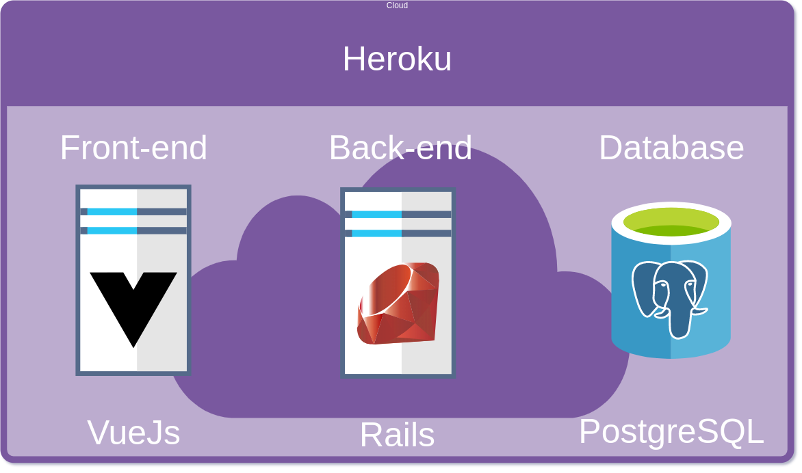
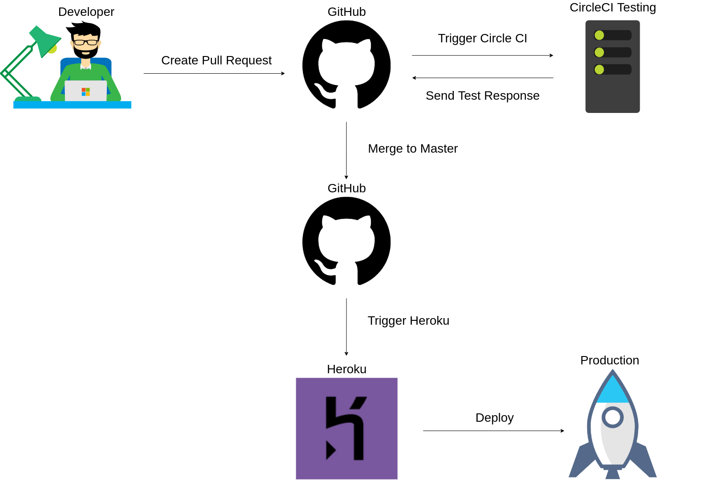

<h1 align="center">
    Herospark Challenge Back-end
</h1>

<p align="center">
  <a href="#rocket-technologies">Technologies</a>&nbsp;&nbsp;&nbsp;|&nbsp;&nbsp;&nbsp;
  <a href="#information_source-how-to-use">How To Use</a>&nbsp;&nbsp;&nbsp;|&nbsp;&nbsp;&nbsp;
  <a href="#black_square_button-architecture">Architecture</a>&nbsp;&nbsp;&nbsp;
</p>

## :rocket: Technologies

This project was developed for a test with the following technologies:

- [ruby](https://www.ruby-lang.org/pt/)
- [rails](https://github.com/rails/rails)
- [postgres](https://www.postgresql.org/)
- [puma](https://github.com/puma/puma)
- [jwt](https://jwt.io/)
- [bcrypt](https://www.npmjs.com/package/bcrypt)
- [rack-cors](https://github.com/cyu/rack-cors)
- [kaminari](https://github.com/kaminari/kaminari)
- [byebug](https://rubygems.org/gems/byebug/versions/9.0.6)
- [faker](https://github.com/faker-ruby/faker)

## :information_source: How To Use

To clone and run this application, you'll need [Git](https://git-scm.com), [docker/docker-compose](https://docs.docker.com/compose/install/) on your computer. From your command line:

```bash
# Clone this repository
$ git clone https://github.com/Eronbello/book-server.git

# Go into the repository
$ cd book-server

# If you choose the local database, just uncomment the base development and comment the production base in .env

# You can see the app running at: http://localhost:3000
$ docker-compose up

```

## :information_source: Documentation


To access the documentation, you will need to download [Insomnia](https://insomnia.rest/) on your computer, after installed just import the docs.json file on your Insomnia

## :black_square_button: Architecture




## :black_square_button: CI/CD

